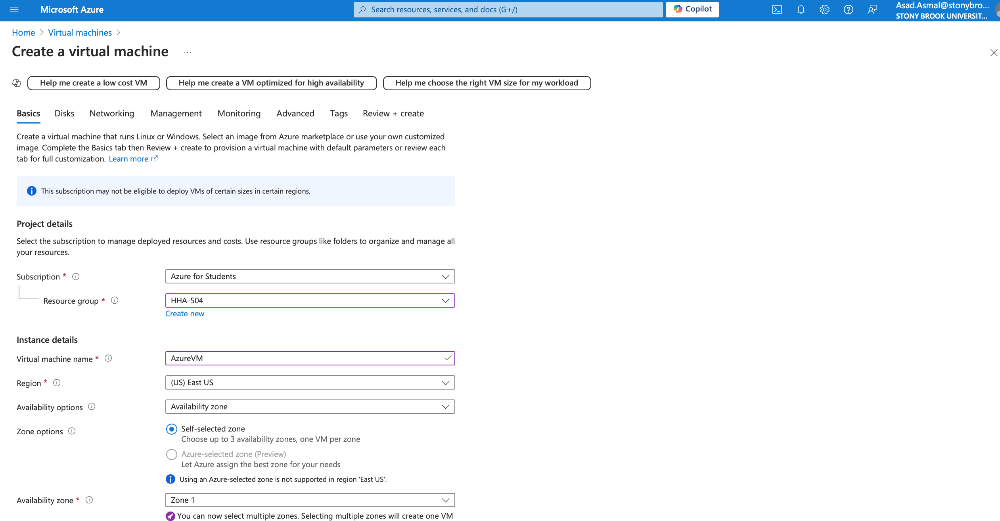

# Virtual Machine Setup for GCP and Azure

## Objective
This report is to document the steps taken to set up virtual machines on Microsoft Azure and Google Cloud Platform (GCP). The screenshots that I included show the step by step process and any challenges that Iencountered while setting up these platforms.

## Azure VM Configuration

### 1. Creating the Virtual Machine
For Azure, I navigated to the Azure portal and set up a new VM using the Azure for Students subscription with the following basic configuration:
 **Image**: Ubuntu Server 22.04 LTS - x64 Gen2
 **Size**: Standard D2s_v3 (2 vCPUs, 8 GiB memory)

