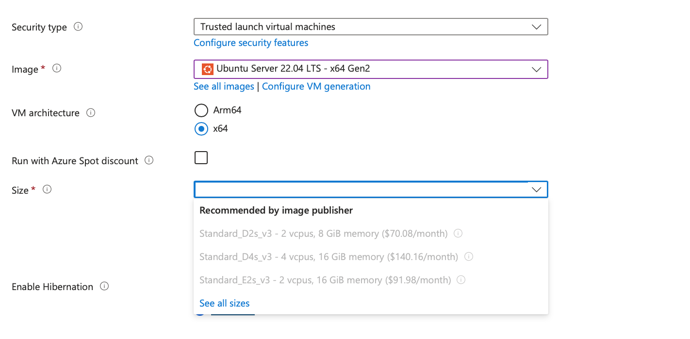
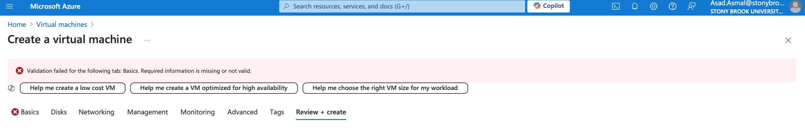
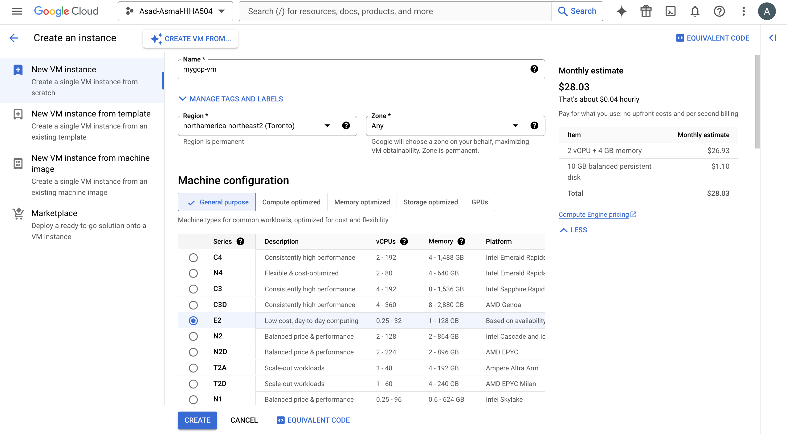
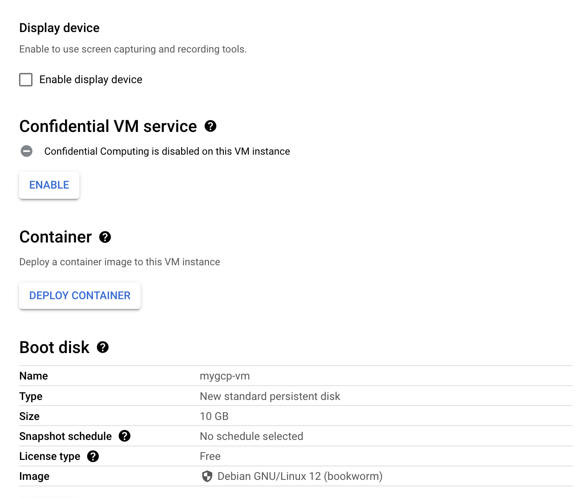
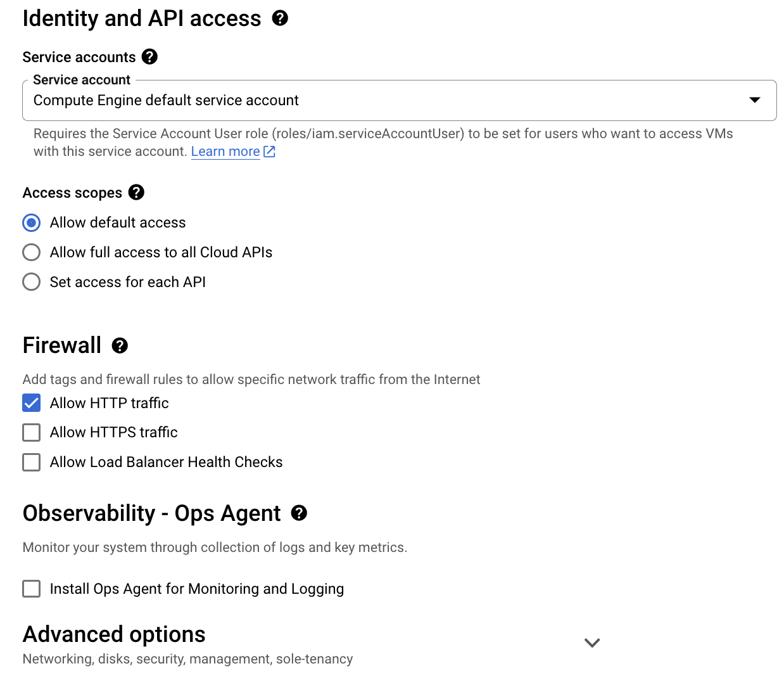
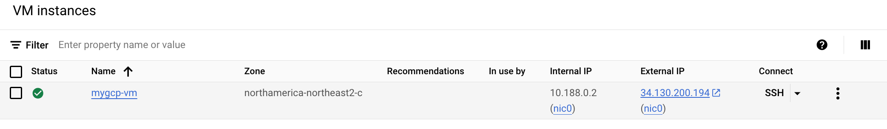
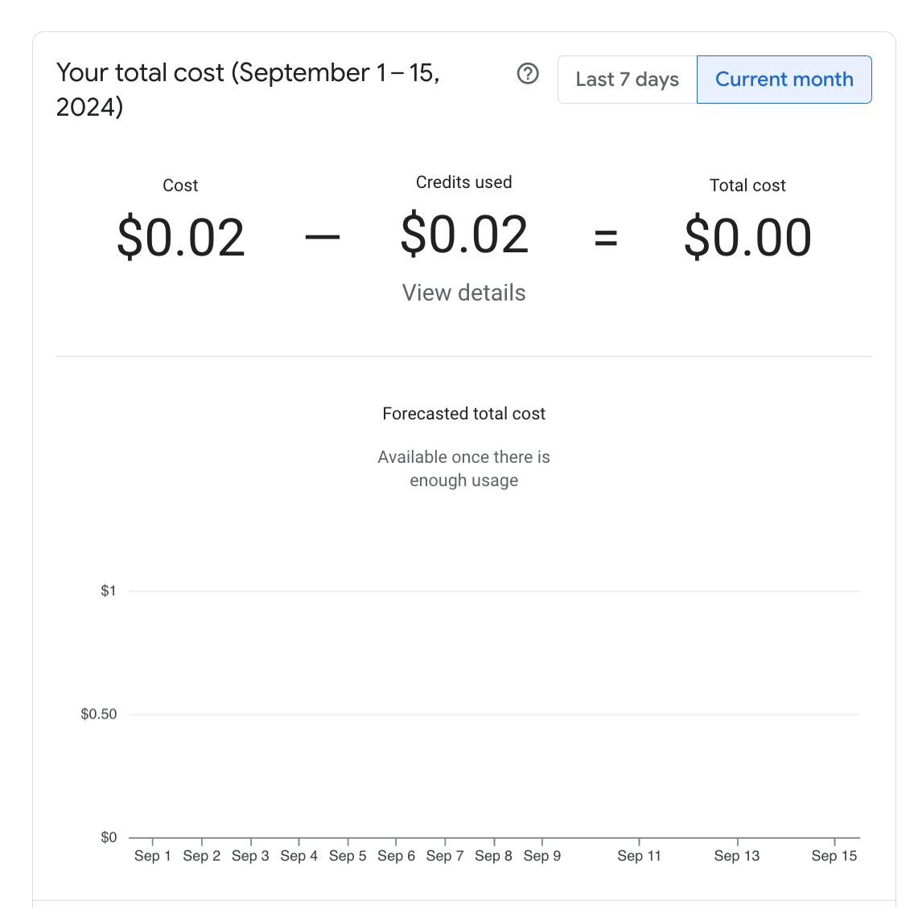

# Virtual Machine Setup for GCP and Azure

## Objective
This report is to document the steps taken to set up virtual machines on Microsoft Azure and Google Cloud Platform (GCP). The screenshots that I included show the step by step process and any challenges that Iencountered while setting up these platforms.

## Azure VM Configuration

### 1. Creating the Virtual Machine
For Azure, I navigated to the Azure portal and set up a new VM using the Azure for Students subscription with the following basic configuration:

 **Image**: Ubuntu Server 22.04 LTS - x64 Gen2
 
 **Size**: Standard D2s_v3 (2 vCPUs, 8 GiB memory)

### 2. Configuring the VM

I chose the recommended security and architecture settings. I didn’t use the Azure Spot Discount because im not sure if thats what I needed and if it would cost more.

### 3. Challenges Encountered
While setting up the VM, I ran into a validation error, which meant some settings were missing or incorrect. I had to go back and double-check everything to make sure all the required fields were filled out properly.

## GCP VM Configuration

### 1. Creating the Virtual Machine
On GCP, I set up a new VM with a focus on keeping costs low while still having enough resources for basic use:

- **Machine Type**: e2-medium (2 vCPUs, 4 GiB memory)  
  *Why*: This type is budget-friendly and works well for general tasks like development, testing, or running small applications.

- **Boot Disk**: Debian GNU/Linux 12 (bookworm), 10 GB standard persistent disk  

### 2. Configuring the VM
For this setup, I used the default access settings and allowed HTTP traffic so I could test web apps easily.

### 3. Challenges Encountered
The setup was smooth with no major issues. I used monitoring tools to keep an eye on the VM and make sure it was working correctly. I actually prefered working GCP's layout compared to Azures which looked a bit more daunting.

### Cost Analysis for GCP VM

After running the GCP virtual machine, the cost incurred was very low. The total cost recorded from September 1 to 15, 2024, was $0.02. This low cost highlights the efficiency of using the chosen VM configuration  for basic tasks and testing, making it a cost-effective option for projects or development environments. The pay-as-you-go model used by GCP makes sure that you only pay for what you use, keeping expenses manageable even with continuous usage for learning and testing purposes.

